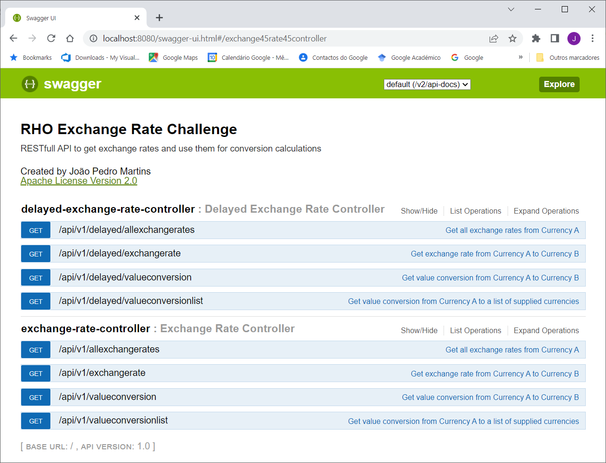

# rho-exchange-rate
RHO Exchange Rate Challenge

## Requirements
Apache Tomcat 2.0 
OpenJDK Version 8 (1.8) or above
IntelliJ IDEA 2022.2 or above (Community or Ultimate Edition)

## Deploy
Download project archive at 
https://github.com/joaopedromartins/rho-exchange-rate/archive/refs/heads/main.zip
and unzip it to a folder in your computer.
### starting with IntelliJ IDEA
Open project with an IDE such as IteliJ IDEA.
Open file DemoAplication.java , right-click and select "run DemoApplication main()"
### Build with Maven and run it JavaVM
In the command line terminal, 
mvn clean package
java -jar target\demo-0.0.1-SNAPSHOT.jar
### Build and Run with Docker
In the command line terminal, go to unziped folder
docker image build -t rho-exchangerate-challenge .
docker container run -p 8080:8080 -d -t rho-exchangerate-challenge bash

## API Operations Examples
Open in your browser http://localhost:8080/swagger-ui.html to see documentation and testing interface

You can also test the following examples directly in your browser

#### Hello World
http://localhost:8080/api/v1/hello-world
Hello World

### exchangerate.host
Implemented always calling the Rest API exchangerate.host

#### Get exchange rate from Currency A (EUR) to Currency B (USD)
http://localhost:8080/api/v1/exchangerate?from=EUR&to=USD
1.017868

#### Get all exchange rates from Currency A (EUR)
http://localhost:8080/api/v1/allexchangerates?from=EUR
{"AED":3.73971, ...  ,"ZMW":16.415399,"ZWL":327.749653}

#### Get value conversion from Currency A (EUR) to Currency B (USD) where amount is (10.00)
http://localhost:8080/api/v1/valueconversion?from=EUR&to=USD&amount=10.00
10.179534

#### Get value conversion from Currency A (EUR) to a list of supplied currencies where amount is (1000.00)
http://localhost:8080/api/v1/valueconversionlist?base=EUR&to=USD,GBP&amount=1000.00
{"USD":1017.867795, "GBP":844.890275}

### Exchangerate.host / Customized datasource on application.properties  Cached with TTL = 1 minute
Implemented to do as few as calls possible to external providers Rest API exchangerate.host and customized provider on application.properties

#### Get delayed exchange rate from Currency A (EUR) to Currency B (GBP) using customized server
http://localhost:8080/api/v1/delayed/exchangerate?server=Custom&from=EUR&to=GBP
0.849481

#### Get delayed all exchange rates from Currency A (EUR) using ExchangeRateHost
http://localhost:8080/api/v1/delayed/allexchangerates?server=ExchangeRateHost&from=EUR
{"AED":3.650586, ... ,"ZMW":16.032066,"ZWL":320.037739}

#### Get delayed value conversion from Currency A (EUR) to Currency B (GBP) where amount is (10.00) using ExchangeRateHost
http://localhost:8080/api/v1/delayed/valueconversion?server=ExchangeRateHost&from=EUR&to=GBP&amount=10
8.44778

#### Get value conversion from Currency A (EUR) to a list of supplied currencies where amount is (10.00)
http://localhost:8080/api/v1/delayed/valueconversionlist?server=ExchangeRateHost&from=EUR&to=AUD&to=GBP&to=HKD&to=USD&amount=10
{"AUD":14.439150, "GBP":8.447780, "HKD":77.987230, "USD":9.938180}